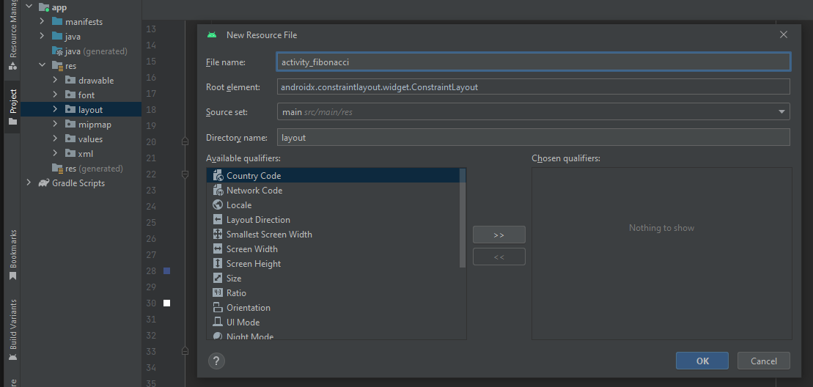
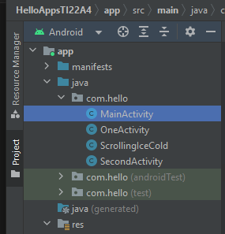
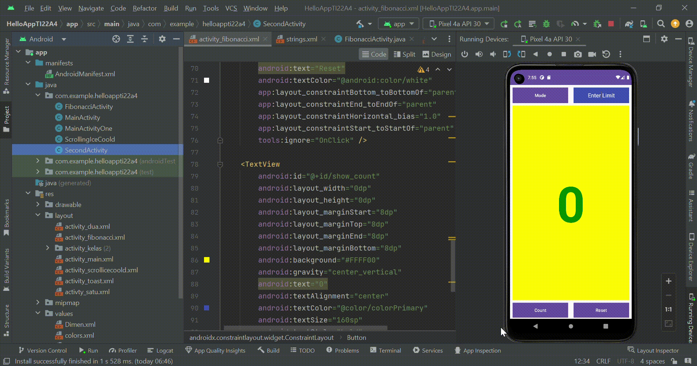

# Fibonacci_Sequence

```
Nama         : Afrizal Fajrianto Anggara Sakti
Nim          : 312210449
Kelas        : TI.22.A4
Mata kuliah  : Pemrograman Mobile
Nama Dosen   : Donny Maulana, S.Kom., M.M.S.I.

```
## Apa itu Fibonacci Sequence

 - Fibonacci Sequence (Deret angka Fibonacci) adalah deret angka yang diperoleh dengan menjumlahkan dua angka sebelumnya:<br>
 1, 1, 2, ... <br>
 1 + 2 = 3 à 1, 1, 2, 3, ... <br>
 2 + 3 = 5 à 1, 1, 2, 3, 5, ... <br>
 3 + 5 = 8 à 1, 1, 2, 3, 5, 8, ... <br>
 Begitu seterusnya. <br>

## Program java Toast Number, dengan menghasilkan Bilangan Fibonacci.

 1. Membuat file **activity_fibonacci.xml**. Membuatnya masuk ke folder **Project** -> **APP** -> **res** -> **layout**. Setelah itu di file layout klik kanan lalu pilih **New** -> **Layout Resource File** dan buat nama filenya menjadi "activity_fibonacci". <br>
 Berikut contoh tampilannya.<br>
 
 <br> 

 - **SINTAKS activity_fibonacci.xml**
 ```xml
 <?xml version="1.0" encoding="utf-8"?>
 <androidx.constraintlayout.widget.ConstraintLayout
    xmlns:android="http://schemas.android.com/apk/res/android"
    xmlns:app="http://schemas.android.com/apk/res-auto"
    xmlns:tools="http://schemas.android.com/tools"
    android:layout_width="match_parent"
    android:layout_height="match_parent"
    tools:context=".MainActivity">

    <EditText
        android:id="@+id/edit_max_fibonacci"
        android:layout_width="0dp"
        android:layout_height="wrap_content"
        android:layout_marginEnd="8dp"
        android:layout_marginTop="8dp"
        android:hint="Maksimum Fibonacci"
        android:inputType="number"
        app:layout_constraintEnd_toEndOf="parent"
        app:layout_constraintTop_toTopOf="parent"
        tools:ignore="MissingTranslation"/>

    <Button
        android:id="@+id/button_toast"
        android:layout_width="190dp"
        android:layout_height="48dp"
        android:layout_marginStart="8dp"
        android:layout_marginTop="8dp"
        android:background="@color/colorPrimary"
        android:onClick="showToast"
        android:textColor="@android:color/white"
        android:text="@string/button_label_toast"
        app:layout_constraintStart_toStartOf="parent"
        app:layout_constraintTop_toTopOf="parent" />

    <Button
        android:id="@+id/button_count"
        android:layout_width="190dp"
        android:layout_height="48dp"
        android:layout_marginStart="8dp"
        android:layout_marginEnd="8dp"
        android:layout_marginBottom="8dp"
        android:background="@color/colorPrimary"
        android:onClick="countUp"
        android:text="@string/button_label_count"
        android:textColor="@android:color/white"
        app:layout_constraintBottom_toBottomOf="parent"
        app:layout_constraintEnd_toEndOf="parent"
        app:layout_constraintHorizontal_bias="0.0"
        app:layout_constraintStart_toStartOf="parent"
        tools:ignore="UsingOnClickInXml,VisualLintButtonSize" />

    <Button
        android:id="@+id/button_finish"
        android:layout_width="190dp"
        android:layout_height="48dp"
        android:layout_marginStart="8dp"
        android:layout_marginEnd="8dp"
        android:layout_marginBottom="8dp"
        android:background="@color/colorPrimary"
        android:onClick="back1"
        android:text="@string/button_label_finish"
        android:textColor="@android:color/white"
        app:layout_constraintBottom_toBottomOf="parent"
        app:layout_constraintEnd_toEndOf="parent"
        app:layout_constraintHorizontal_bias="1.0"
        app:layout_constraintStart_toStartOf="parent"
        tools:ignore="UsingOnClickInXml" />

    <TextView
        android:id="@+id/show_count"
        android:layout_width="0dp"
        android:layout_height="0dp"
        android:layout_marginStart="8dp"
        android:layout_marginTop="8dp"
        android:layout_marginEnd="8dp"
        android:layout_marginBottom="8dp"
        android:background="#FFFF00"
        android:gravity="center_vertical"
        android:text="@string/count_initial_value"
        android:textAlignment="center"
        android:textColor="@color/colorPrimary"
        android:textSize="160sp"
        android:textStyle="bold"
        app:layout_constraintBottom_toTopOf="@id/button_count"
        app:layout_constraintEnd_toEndOf="parent"
        app:layout_constraintStart_toStartOf="parent"
        app:layout_constraintTop_toBottomOf="@id/button_toast"
        tools:ignore="RtlCompat" />
 </androidx.constraintlayout.widget.ConstraintLayout>
 ```

 2. Masuk ke file **strings.xml**. Folder tersebut berada di **Project** -> **APP** -> **res** -> **values** -> **strings**. Lalu masukkan sintaks yang sudah tertera di bawah ini.

 ```xml
 <resources>
    <string name="app_name">FibonacciSequence</string>
    <string name="button_label_toast">Toast</string>
    <string name="button_label_count">Count</string>
    <string name="count_initial_value">1</string>
    <string name="toast_message">Bilangan Fibonacci</string>
    <string name="button_label_finish">Reset</string>
 </resources>
 ```
 
 3. Masuk ke file **colors.xml**. Folder tersebut berada di **Project** -> **APP** -> **res** -> **values** -> **colors**. Lalu masukkan sintaks yang sudah tertera di bawah ini.

 ```xml
 <?xml version="1.0" encoding="utf-8"?>
 <resources>
    <color name="black">#FF000000</color>
    <color name="white">#FFFFFFFF</color>
    <color name="colorPrimary">#3F5185</color>
    <color name="colorPrimaryDark">#303F9F</color>
    <color name="colorAccent">#FF4881</color>
 </resources>
 ```

 4. Setelah itu masuk ke file **MainActivity.java**. File tersebut berada di **Project** -> **APP** -> **com.hello** -> **MainActivity**. <br>
 Berikut contoh gambar file tersebut berada.<br>

 <br>
 
 - **SINTAKS** MainActivity.java

 ```java
 package com.hello;

 import android.os.Bundle;
 import android.view.View;
 import android.widget.EditText;
 import android.widget.TextView;
 import android.widget.Toast;

 import androidx.appcompat.app.AppCompatActivity;

 public class MainActivity extends AppCompatActivity {
     private TextView showCount;
     private int count = 0;
     private long fibN = 0; // Mengubah inisialisasi Fibonacci
     private long fibNMinus1 = 1;
     private EditText edit_max_fibonacci;

     @Override
     protected void onCreate(Bundle savedInstanceState) {
         super.onCreate(savedInstanceState);
         setContentView(R.layout.activity_fibonancci);

         showCount = findViewById(R.id.show_count);
         edit_max_fibonacci = findViewById(R.id.edit_max_fibonacci);

         updateCountDisplay();
     }

     private void updateCountDisplay() {
         showCount.setText(String.valueOf(fibN));

         if (count % 4 == 0) {
             showCount.setTextColor(getResources().getColor(R.color.colorPrimary));
         } else if (count % 4 == 1) {
             showCount.setTextColor(getResources().getColor(R.color.colorAccent));
         } else if (count % 4 == 2) {
             showCount.setTextColor(getResources().getColor(R.color.colorPrimary));
         } else {
             showCount.setTextColor(getResources().getColor(R.color.colorAccent));
         }
     }

     public void showToast(View view) {
         Toast.makeText(this, "Bilangan Fibonacci",
                 Toast.LENGTH_SHORT).show();
     }

     public void countUp(View view) {
         int maxFibonacci = Integer.parseInt(edit_max_fibonacci.getText().toString());

         if (count >= maxFibonacci) {
             Toast.makeText(this, "Maksimum Fibonacci tercapai", Toast.LENGTH_SHORT).show();
             return;
         }

         long fibCurrent;
         if (count == 0) {
             fibCurrent = 0; // Fibonacci pertama adalah 0
         } else if (count == 1) {
             fibCurrent = 1; // Fibonacci kedua adalah 1
         } else {
             fibCurrent = fibN + fibNMinus1;
         }

         fibNMinus1 = fibN;
         fibN = fibCurrent;
         updateCountDisplay();

         count++;
     }

     public void back1(View view) {
         count = 0;
         fibN = 0;
         fibNMinus1 = 1;
         updateCountDisplay();
     }
 }
 ```

## Penjelasan **MainActivity.java**

```java
public void countUp(View view) {
    int maxFibonacci = Integer.parseInt(edit_max_fibonacci.getText().toString());

    if (count >= maxFibonacci) {
        Toast.makeText(this, "Maksimum Fibonacci tercapai", Toast.LENGTH_SHORT).show();
        return;
    }

    long fibCurrent;
    if (count == 0 || count == 1) {
        fibCurrent = 1;
    } else {
        fibCurrent = fibNMinus1 + fibNMinus2;
    }

    fibNMinus2 = fibNMinus1;
    fibNMinus1 = fibCurrent;
    updateCountDisplay();

    count++;
}
```
- Jika `count` adalah 0 atau 1, maka `fibCurrent` diatur ke 1 karena dua angka pertama dalam urutan Fibonacci adalah 0 dan 1. Jika `count` lebih besar dari 1, maka `fibCurrent` dihitung dengan menjumlahkan dua angka sebelumnya dalam urutan Fibonacci (`fibNMinus1` dan `fibNMinus2`). Kemudian, `fibNMinus2` diperbarui menjadi `fibNMinus1`, dan `fibNMinus1` diperbarui menjadi `fibCurrent`. Ini adalah cara menghasilkan urutan bilangan Fibonacci selanjutnya.
<br>
<br>
<br>

```java
private void updateCountDisplay() {
    showCount.setText(String.valueOf(fibNMinus1));

    if (count % 4 == 0) {
        showCount.setTextColor(getResources().getColor(R.color.colorPrimary));
    } else if (count % 4 == 1) {
        showCount.setTextColor(getResources().getColor(R.color.colorAccent));
    } else if (count % 4 == 2) {
        showCount.setTextColor(getResources().getColor(R.color.colorPrimary));
    } else {
        showCount.setTextColor(getResources().getColor(R.color.colorAccent));
    }
}
```
- Dalam metode ini, kita menggunakan operasi modulus (`%`) pada variabel `count` untuk menentukan perubahan warna teks. Ketika `count` adalah kelipatan 4, warna teks diatur ke `colorPrimary`, ketika `count` adalah kelipatan 4 + 1, warna teks diatur ke `colorAccent`, dan begitu seterusnya. Itu adalah cara warna teks diatur dalam urutan warna yang bergantian.
<br>
<br>
<br>

```java
public void back1(View view) {
    count = 0;
    fibNMinus1 = 1;
    fibNMinus2 = 0;
    updateCountDisplay();
}
```
- Pada metode `back1`, variabel `count` diatur kembali ke 0, sedangkan variabel `fibNMinus1` dan `fibNMinus2` diatur ulang ke nilai awalnya. Setelah itu, metode `updateCountDisplay()` dipanggil untuk memperbarui tampilan teks dan warna saat melakukan reset.
<br>
<br>
<br>

```java
public void countUp(View view) {
    int maxFibonacci = Integer.parseInt(edit_max_fibonacci.getText().toString());

    if (count >= maxFibonacci) {
        Toast.makeText(this, "Maksimum Fibonacci tercapai", Toast.LENGTH_SHORT).show();
        return;
    }

    long fibCurrent;
    if (count == 0 || count == 1) {
        fibCurrent = 1;
    } else {
        fibCurrent = fibNMinus1 + fibNMinus2;
    }

    fibNMinus2 = fibNMinus1;
    fibNMinus1 = fibCurrent;
    updateCountDisplay();

    count++;
}
```
- Dalam metode `countUp`, penentuan nilai baru untuk `fibCurrent` tergantung pada nilai saat ini dari `count`. Jika `count` adalah 0 atau 1, maka `fibCurrent` diatur ke 1. Untuk nilai `count` yang lebih besar, `fibCurrent` dihitung sebagai jumlah dari dua angka sebelumnya dalam deret Fibonacci (`fibNMinus1` dan `fibNMinus2`). Kemudian, variabel `count` ditingkatkan, dan metode `updateCountDisplay()` dipanggil untuk memperbarui tampilan teks yang menunjukkan angka Fibonacci saat ini.

## TAMPILAN PROGRAM SAAT DI RUN

   <br>

## **FINISH**